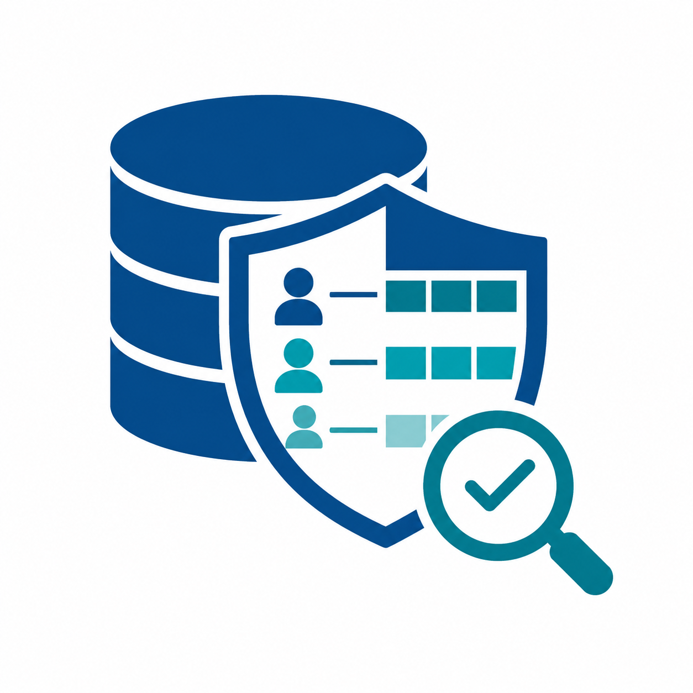

<p align="center">
  
</p>

<h1 align="center">DB Access Security Audit</h1>

An AI agent skill that audits **database authorization**: **Role-Based Access Control (RBAC)**, privileges, and **row/document-level isolation** across platforms: **PostgreSQL/Supabase, MySQL, SQL Server**, and **NoSQL** (Firestore, MongoDB, DynamoDB).

A platform-neutral core workflow loads a platform-specific reference once the target database is known. The agent inspects your schema, policies/rules/IAM, grants, roles, and privileged routines as they actually exist, not as they are intended to exist. It reconstructs your authorization model, tests it against least-privilege and scoped-RBAC principles, and produces a remediation-ready report with severity ratings, evidence, exploit scenarios, and exact fixes.

<p align="center">
  
  
  
  <a href="https://x.com/ashwarysh"></a>
</p>

---

## What it audits

- Row/document-level isolation and its correctness (read filters + write validation)
- Privileges / grants / IAM to anonymous, authenticated, and admin/service principals
- Privileged routines and bypass paths (Postgres `SECURITY DEFINER`, SQL Server `EXECUTE AS` / ownership chaining, MySQL definer routines, Firebase Admin SDK, IAM `*`)
- Cross-tenant and cross-user access risks
- Role hierarchy and privilege inheritance
- Separation of duties conflicts
- Platform specifics: Postgres/Supabase (built-in roles, JWT claims, Storage, Realtime, column grants), MySQL (definer views/routines, global privileges), SQL Server (RLS predicates, `TRUSTWORTHY`, guest), NoSQL (Firestore rules, MongoDB RBAC, DynamoDB `LeadingKeys`)

---

## Installation

```bash
npx skills add ashwaryy/db-access-audit-skill
```

Or install via the Claude Code skill marketplace.

---

## Usage

Invoke the skill directly in any supported agent. In Claude Code, type `/db-access-audit` to start a guided audit.

The skill walks through a pre-flight questionnaire to understand your tenancy model, user types, auth provider, and sensitive data domains, minimising interruptions while building enough context to audit accurately.

### Output

Choose your preferred report format at the start of the session:

- **Interactive HTML** *(default)*: single file, browser-ready, sidebar navigation, collapsible findings, severity colour-coding, remediation roadmap
- **Markdown**: plain text, suitable for committing to a repo or pasting into a wiki

---

## What the report includes

| Section | Contents |
|---|---|
| Executive Summary | Overall risk rating, top risks, strong controls, immediate actions |
| Scope and Access | Database, environment, schemas inspected, access method used |
| Authorization Model | Users, roles, permissions, scopes, hierarchy, separation of duties |
| Inventory | Resources, row/document-control coverage, access-control matrix, permissions/IAM, privileged routines, role membership |
| Findings | Severity-rated findings with evidence, exploit scenario, remediation (SQL / rule / IAM), and validation steps |
| Remediation Roadmap | Prioritised by 0–48 hours / 1–2 weeks / 1–2 months / long-term governance |
| Validation Test Plan | Test cases for negative authorization scenarios |

---

## Access tiers

The skill works at any level of database access:

| Tier | Method | Confidence |
|---|---|---|
| 1 | Live connection via MCP tool | Full |
| 2 | Live connection via CLI or SDK | Full |
| 3 | Exported schema dump | High |
| 4 | ORM models or migration history | Medium |
| 5 | Application code only | Low |

---

## Safety

The skill is metadata-only by default. It does not apply fixes, run migrations, alter schemas, change grants, or modify data, regardless of what database access it has been granted. Behavioral reads against live data require explicit opt-in; write-shaped tests require separate opt-in. After the report is delivered, it stops. Any remediation action requires an explicit follow-up instruction from you.

---

## License

MIT; see [LICENSE](LICENSE)
